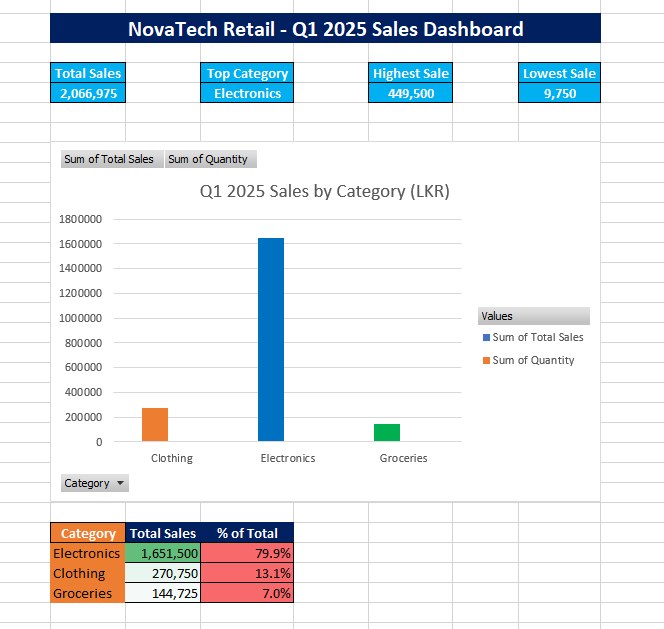

## Project 02 — NovaTech Retail Sales Dashboard

### Overview
Q1 2025 sales analysis dashboard for NovaTech Retail 
covering Electronics, Clothing, and Groceries categories.

### Formulas Used
- `=VLOOKUP()` — Auto product details
- `=SUMIF()` — Category wise sales
- `=MAX() / MIN()` — Best/Worst sales
- `=AVERAGE()` — Average sale value

### Features
- VLOOKUP based product lookup system
- Pivot Table category analysis
- Interactive Pivot Chart
- KPI Dashboard with key metrics

### Tools
Microsoft Excel 2021
